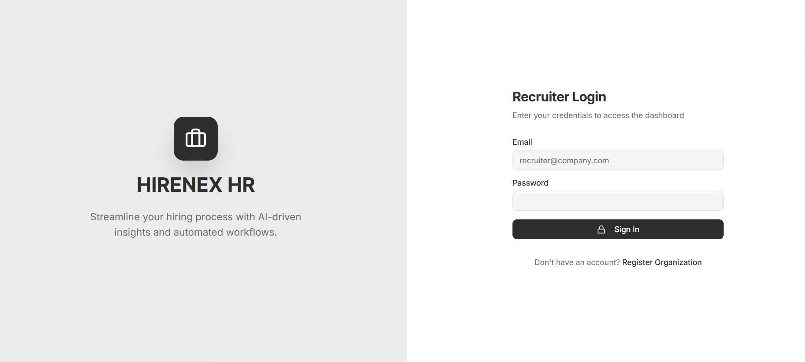

<div align="center">

# HIRENEX - HR Portal

### AI-Powered Recruitment Analytics Dashboard

[](https://nextjs.org/)
[](https://www.typescriptlang.org/)
[](https://react.dev/)
[](https://supabase.com/)
[](https://tailwindcss.com/)

*Enterprise HR dashboard for managing candidates, reviewing assessments, monitoring proctoring events, and making data-driven hiring decisions.*

<br />

<br />

[Features](#features) • [Analytics](#candidate-analytics) • [Installation](#installation) • [Structure](#project-structure)

</div>

---

## Table of Contents

- [Overview](#overview)
- [Features](#features)
- [Dashboard Screenshots](#dashboard-preview)
- [Candidate Analytics](#candidate-analytics)
- [Proctoring Review](#proctoring-review)
- [Resume Shortlisting](#bulk-resume-shortlisting)
- [Tech Stack](#tech-stack)
- [Installation](#installation)
- [Environment Variables](#environment-variables)
- [API Endpoints](#api-endpoints)
- [Project Structure](#project-structure)
- [Deployment](#deployment)

---

## Overview

HIRENEX HR Portal is the recruiter-facing dashboard of the HIRENEX recruitment ecosystem. It provides comprehensive analytics, candidate management, and AI-powered hiring recommendations to streamline the recruitment workflow.

### Key Capabilities

| Feature | Description |
|---------|-------------|
| **Recruitment Dashboard**| Real-time overview of pipeline metrics and candidate flow |
| **Candidate Analytics**| Deep-dive into individual candidate performance with visualizations |
| **Proctoring Review**| Live monitoring and historical audit of assessment integrity |
| **Bulk Resume Processing**| AI-powered resume parsing and job matching at scale |
| **Hiring Decisions**| AI recommendations with manual override capability |
| **Job Management**| Create, edit, and manage job postings |

---

## Features

### **HR Dashboard**
- **Pipeline Overview**: Total candidates, completed assessments, pending reviews
- **Score Averages**: Technical, Psychometric, Coding, and Integrity scores
- **Top Performers**: Ranked list of best-performing candidates
- **Recent Activity**: Latest candidate submissions and job applications
- **Active Jobs**: Quick view of open positions with applicant counts

### **Candidate Detail View**
Comprehensive candidate profile with multiple tabs:

#### Overview Tab
- Personal information and contact details
- Education history (degree, institution, GPA)
- Work experience and employment status
- Skills inventory (primary and secondary)
- Social links (LinkedIn, GitHub, Portfolio)

#### Assessment Scores Tab
- **Total Score**with breakdown visualization
- **Technical Score**: MCQ performance analysis
- **Psychometric Score**: Personality profile radar chart
- **Coding Score**: Code submission results with test case breakdown
- **Communication Score**: Text response evaluations

#### Proctoring Tab
- **Integrity Score**: Overall trust rating
- **Event Timeline**: Chronological list of flagged events
- **Severity Distribution**: Critical, High, Medium, Low violations
- **Screenshots**: Captured moments during assessment
- **Video Recordings**: Session recordings for review

#### Resume Analysis Tab
- **AI-Parsed Resume**: Extracted information
- **Match Score**: Job compatibility percentage
- **Strengths & Weaknesses**: AI-identified traits
- **Skills Gap Analysis**: Missing required skills

### **Assessment Analytics**
- **Score Distribution Charts**: Bar charts showing performance breakdown
- **Radar Charts**: Psychometric profile visualization (Big Five traits)
- **Competency Mapping**: Skill-to-score correlation analysis
- **Comparison View**: Benchmark against other candidates

---

## Proctoring Review

Real-time and historical proctoring event management.

### Live Monitoring
- **Active Sessions**: See all candidates currently taking assessments
- **Real-time Events**: WebSocket-powered event streaming
- **Critical Alerts**: Instant notifications for severe violations
- **Session Status**: Webcam, connectivity, and heartbeat monitoring

### Event Types Tracked
| Event | Category | Severity |
|-------|----------|----------|
| Multiple Faces | Webcam | Critical |
| Face Lost | Webcam | Medium |
| Looking Away | Webcam | Medium |
| Tab Switch | Browser | High |
| Window Blur | Browser | Medium |
| Fullscreen Exit | Browser | Medium |
| Copy/Paste Detected | Clipboard | High |
| DevTools Attempt | Keyboard | Critical |

### Media Review
- **Screenshots**: Timestamped captures of violations
- **Session Recordings**: Full video playback capability
- **Event Correlation**: Link screenshots to specific events

---

## Bulk Resume Shortlisting

AI-powered batch processing of candidate resumes.

### Workflow
1. **Select Job**: Choose target position for matching
2. **Upload Resumes**: Drag-and-drop multiple PDFs
3. **AI Processing**: Automatic parsing and scoring
4. **Review Results**: See match scores and extracted data
5. **Bulk Actions**: Accept/Reject candidates in batches

### Extracted Information
- Contact details (Name, Email, Phone, Location)
- Skills (categorized and matched to requirements)
- Education history with degrees and institutions
- Work experience with company and role history
- Certifications and achievements
- Social profiles (LinkedIn, GitHub, Portfolio)

### Matching Algorithm
- **Skill Matching**: Compare against job requirements
- **Experience Scoring**: Years of relevant experience
- **Education Fit**: Degree and field relevance
- **Overall Match Score**: Weighted composite score
- **Eligibility Status**: Pass/Fail based on cutoffs

---

## Tech Stack

### Core Framework
| Category | Technology | Version |
|----------|------------|---------|
| **Framework**| Next.js (App Router) | 16.1 |
| **Language**| TypeScript | 5.0 |
| **UI Library**| React | 19.2 |
| **Database**| Supabase (PostgreSQL) | Latest |
| **Authentication**| Supabase Auth | SSR |

### Frontend & UI
| Technology | Purpose |
|------------|---------|
| **Tailwind CSS 4**| Utility-first styling |
| **Framer Motion**| Animations and transitions |
| **Radix UI**| Accessible component primitives |
| **Lucide React**| Icon system |
| **Recharts**| Data visualization (charts, graphs) |
| **Sonner**| Toast notifications |

### Data & Documents
| Technology | Purpose |
|------------|---------|
| **pdf-parse**| PDF text extraction |
| **pdfjs-dist**| PDF rendering |
| **unpdf**| Advanced PDF parsing |

---

## Installation

### Prerequisites
- **Node.js**18+ (LTS recommended)
- **npm**, **yarn**, **pnpm**, or **bun**
- **Supabase**account with Service Role Key
- Access to [HIRENEX Candidate Portal](https://github.com/magi8101/candidate-portal) database

### Quick Start

```bash
# 1. Clone the repository
git clone https://github.com/magi8101/hr-portal.git
cd hr-portal

# 2. Install dependencies
npm install
# or: yarn install / pnpm install / bun install

# 3. Set up environment variables
cp .env.example .env.local

# 4. Configure your .env.local (see Environment Variables section)

# 5. Run the development server
npm run dev

# 6. Open http://localhost:3001 (use different port from candidate portal)
```

### Build for Production

```bash
# Build the application
npm run build

# Start production server
npm run start
```

---

## 🔐 Environment Variables

Create a `.env.local` file in the root directory:

```env
# Supabase Configuration (Required)
NEXT_PUBLIC_SUPABASE_URL=https://your-project.supabase.co
NEXT_PUBLIC_SUPABASE_ANON_KEY=your-anon-key

# Service Role Key (Required for admin operations)
SUPABASE_SERVICE_ROLE_KEY=your-service-role-key
```

| Variable | Required | Description |
|----------|----------|-------------|
| `NEXT_PUBLIC_SUPABASE_URL` | Yes | Your Supabase project URL |
| `NEXT_PUBLIC_SUPABASE_ANON_KEY` | Yes | Supabase anonymous/public key |
| `SUPABASE_SERVICE_ROLE_KEY` | Yes | Service role key for bypassing RLS |

>  **Security Note**: The Service Role Key bypasses Row Level Security. Never expose it on the client side.

---

## API Endpoints

### Candidate APIs
| Endpoint | Method | Description |
|----------|--------|-------------|
| `/api/candidate/[id]` | GET | Fetch complete candidate data |
| `/api/candidate/[id]/decision` | POST | Submit hiring decision |

### Resume APIs
| Endpoint | Method | Description |
|----------|--------|-------------|
| `/api/parse-resume` | POST | Parse uploaded resume PDF |

---

## Project Structure

```
src/
├── app/                          # Next.js App Router
│   ├── page.tsx                  # HR Dashboard (main page)
│   ├── login/                    # HR login page
│   ├── signup/                   # HR registration
│   ├── candidate/[id]/           # Candidate detail view
│   ├── candidates/               # Candidate list view
│   ├── jobs/                     # Job management
│   │   └── [id]/                 # Job detail/edit
│   ├── proctoring/               # Live proctoring monitor
│   ├── resume-shortlist/         # Bulk resume processing
│   ├── profile/                  # HR profile settings
│   └── api/                      # API routes
│       ├── candidate/            # Candidate data APIs
│       └── parse-resume/         # Resume parsing API
│
├── components/
│   ├── ui/                       # Radix UI components
│   │   ├── button.tsx
│   │   ├── card.tsx
│   │   ├── badge.tsx
│   │   ├── progress.tsx
│   │   ├── tabs.tsx
│   │   ├── dialog.tsx
│   │   ├── select.tsx
│   │   ├── slider.tsx
│   │   └── scroll-area.tsx
│   ├── layout/                   # Header, navigation
│   ├── providers/                # Theme provider
│   └── resume-shortlist-modal.tsx # Resume upload modal
│
└── lib/
    ├── supabase/                 # Supabase client (client/server)
    └── utils.ts                  # Utility functions
```

---

## Dashboard Preview

### Main Dashboard
- Pipeline statistics cards
- Score average progress bars
- Recent candidates list
- Top performers ranking
- Active job postings grid

### Candidate Detail
- Tabbed interface (Overview, Scores, Proctoring, Resume)
- Interactive charts (Radar, Bar, Pie)
- Decision buttons (Hire, Reject, Consider)
- Proctoring media gallery

---

## Deployment

### Vercel (Recommended)
```bash
# Install Vercel CLI
npm i -g vercel

# Deploy
vercel

# Set environment variables in Vercel Dashboard
```

### Docker
```dockerfile
FROM node:18-alpine
WORKDIR /app
COPY package*.json ./
RUN npm ci --only=production
COPY . .
RUN npm run build
EXPOSE 3000
CMD ["npm", "start"]
```

---

## Related Projects

- **[HIRENEX Candidate Portal](https://github.com/magi8101/candidate-portal)**- Candidate-facing assessment platform

---

## License

MIT License - feel free to use for learning, development, and production.

---

<div align="center">

### Built by HIRENEX Team

**Next.js** • **Supabase** • **Recharts** • **Tailwind CSS**

---

[Back to Top](#hirenex---hr-portal)

</div>
